# agriqon Design System

You are building UI for **agriqon**. Light-themed, warm palette, monospace typography (DM Sans), compact density on a 4px grid, expressive motion.

## Visual Reference

**IMPORTANT**: Study ALL screenshots below before writing any UI. Match colors, typography, spacing, layout, and motion exactly as shown.

### Homepage

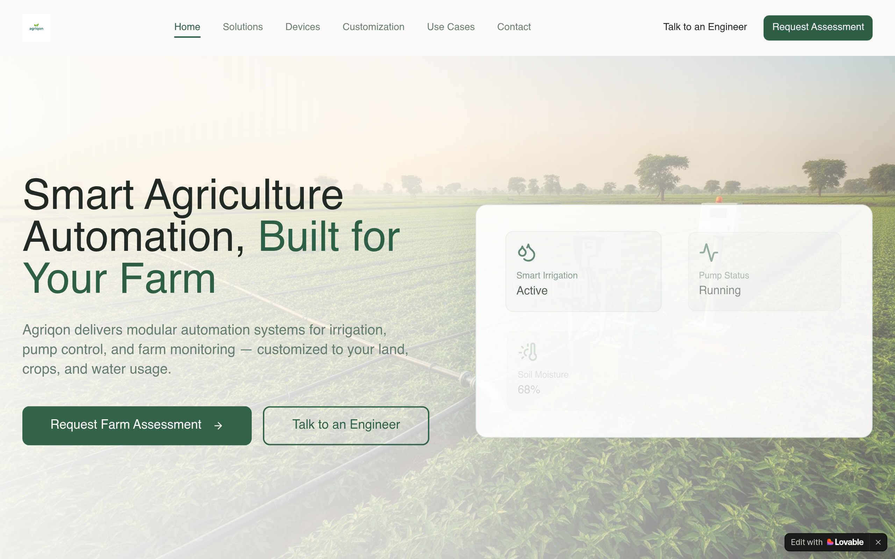

### Scroll Journey (Cinematic Visual States)

> These screenshots capture the website at different scroll depths. The design changes dramatically as you scroll — each frame shows a different cinematic state. Replicate these exact visual transitions.

#### 0% — Hero / Above the fold

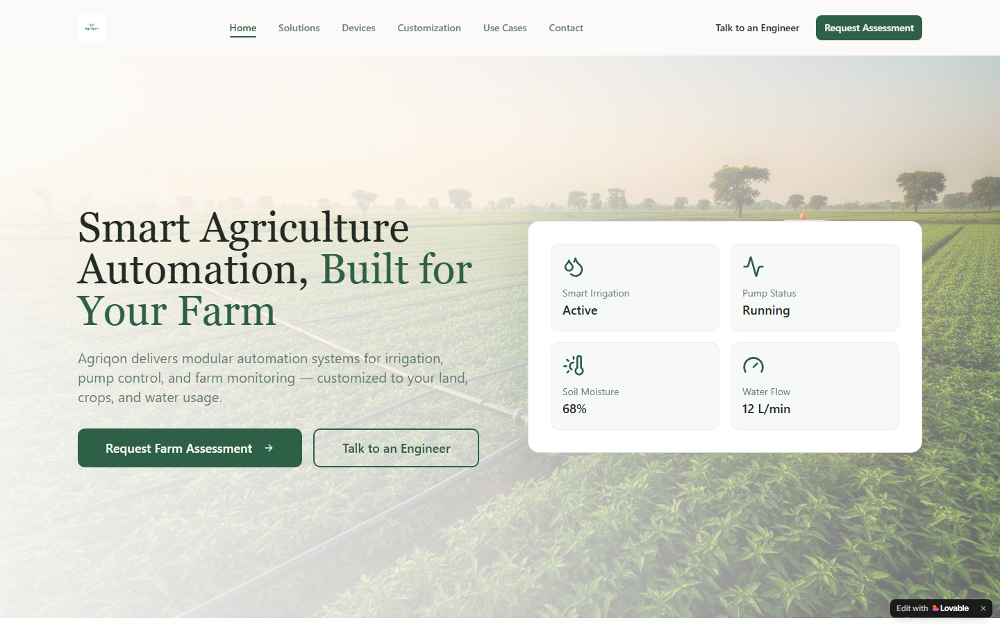

#### 17% — Mid-page at 17% scroll

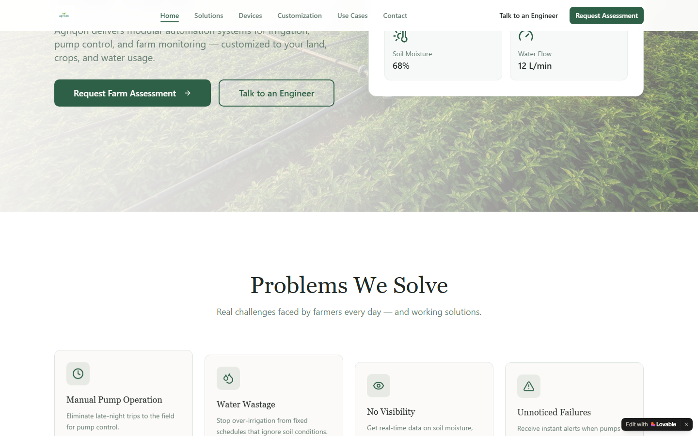

#### 33% — Mid-page at 33% scroll

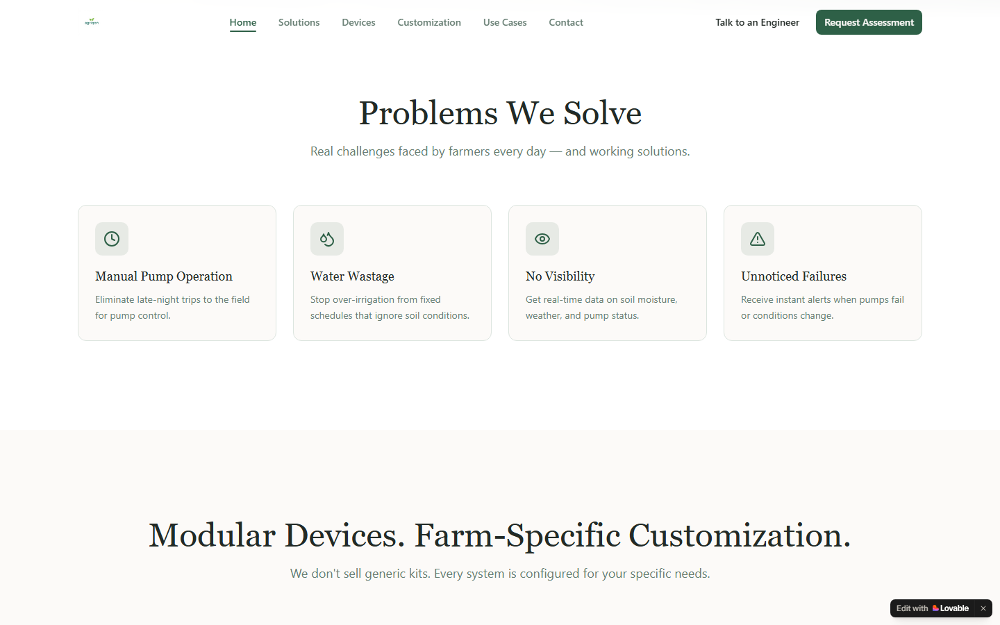

#### 50% — Mid-page at 50% scroll

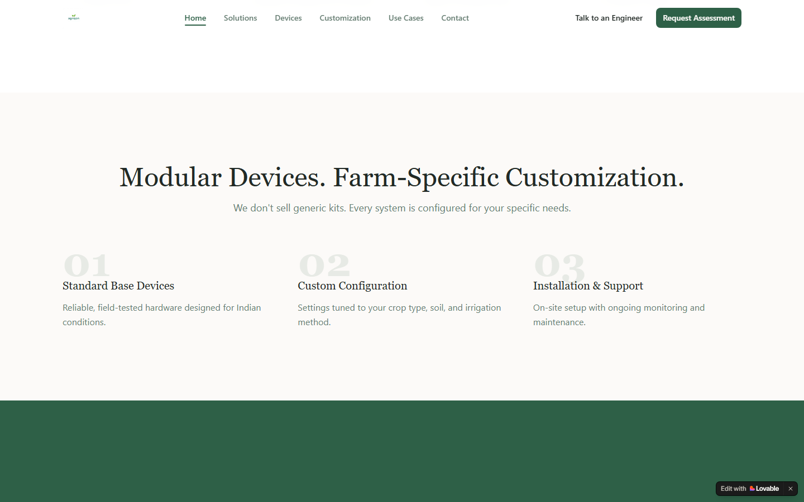

#### 67% — Mid-page at 67% scroll

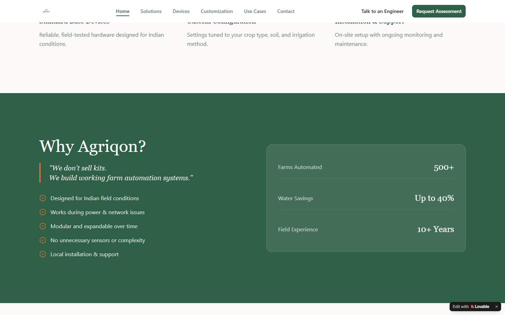

#### 83% — Mid-page at 83% scroll

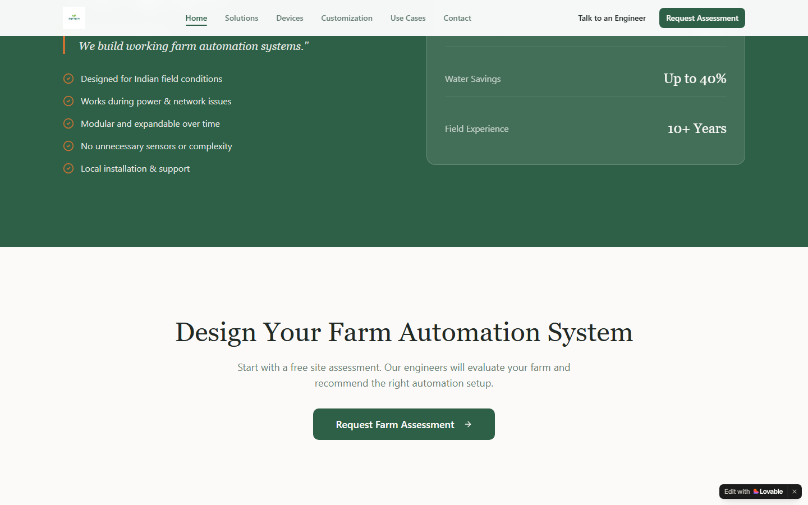

#### 100% — Footer / End of page

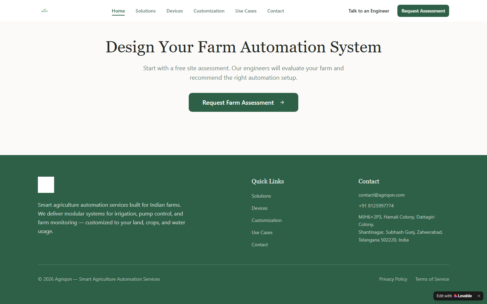

> Read `references/DESIGN.md` for full token details. Read `references/ANIMATIONS.md` for motion specs. Read `references/LAYOUT.md` for layout structure. Read `references/COMPONENTS.md` for component patterns.

## Ultra Reference Files

This package includes extended documentation. **Read these files before implementing:**

| File | Contents |
|------|----------|
| `references/DESIGN.md` | Full design system tokens, colors, typography, spacing |
| `references/VISUAL_GUIDE.md` | **START HERE** — Master visual guide with all screenshots embedded |
| `references/ANIMATIONS.md` | CSS keyframes, scroll triggers, motion library stack, video specs |
| `references/LAYOUT.md` | Flex/grid containers, page structure, spacing relationships |
| `references/COMPONENTS.md` | DOM component patterns, HTML structure, class fingerprints |
| `references/INTERACTIONS.md` | Hover/focus states with before/after style diffs |
| `screens/scroll/` | 7 scroll journey screenshots showing cinematic states |

## Design Philosophy

- **Layered depth** — use shadow tokens to create a sense of physical layering. Each elevation level has a specific shadow.
- **Gradient accents** — gradients are used thoughtfully for emphasis, not decoration.
- **Single typeface** — DM Sans carries all text. Hierarchy comes from size, weight, and color — never font mixing.
- **compact density** — 4px base grid. Every dimension is a multiple of 4.
- **warm palette** — the color temperature runs warm, matching the monospace typography.
- **Restrained accent** — `#cc7333` is the only pop of color. Used exclusively for CTAs, links, focus rings, and active states.
- **Expressive motion** — animations are an integral part of the experience. Use spring physics and layout animations.

## Color System

### Core Palette

| Role | Token | Hex | Use |
|------|-------|-----|-----|
| Background | `--background` | `#ffffff` | Page/app background |
| Surface | `--surface` | `#f3f1ed` | Cards, panels, modals |
| Text Primary | `--text-primary` | `#222a26` | Headings, body text |
| Text Muted | `--text-muted` | `#677e73` | Captions, placeholders |
| Accent | `--accent` | `#cc7333` | CTAs, links, focus rings |
| Border | `--border` | `#2b3b33` | Dividers, card borders |

### Status Colors

| Status | Hex | Use |
|--------|-----|-----|
| Success | `#2e6047` | Confirmations, positive trends |
| Danger | `#ef4343` | Errors, destructive actions |

### Extended Palette

- **border:** `#dce5df` — Light surface or highlight color
- **sidebar-border:** `#e5e7eb` — Light surface or highlight color
- **sidebar-primary:** `#18181b` — Deep background layer or shadow color
- `#9ca3af`
- **sidebar-ring:** `#3b82f6`
- **primary:** `#4db377`
- **sidebar-foreground:** `#3f3f46`
- **destructive:** `#cf3030` — Destructive actions, error states

### CSS Variable Tokens

```css
--background: 40 33% 98%;
--foreground: 150 10% 15%;
--card: 0 0% 100%;
--card-foreground: 150 10% 15%;
--popover: 0 0% 100%;
--popover-foreground: 150 10% 15%;
--primary: 150 35% 28%;
--primary-foreground: 40 33% 98%;
--secondary: 140 20% 94%;
--secondary-foreground: 150 35% 28%;
--muted: 40 20% 94%;
--muted-foreground: 150 10% 45%;
--accent: 25 60% 50%;
--accent-foreground: 40 33% 98%;
--destructive: 0 84% 60%;
--destructive-foreground: 40 33% 98%;
--border: 140 15% 88%;
--sidebar-background: 0 0% 98%;
--sidebar-foreground: 240 5.3% 26.1%;
--sidebar-primary: 240 5.9% 10%;
```

## Typography

### Font Stack

- **DM Sans** — Heading 1, Heading 2, Heading 3
- **SFMono-Regular** — Body, Caption, Code

### Font Sources

```css
@font-face {
  font-family: "CameraPlainVariable";
  src: url("fonts/CameraPlainVariable-100.woff2") format("woff2");
  font-weight: 100;
}
@font-face {
  font-family: "DM Sans";
  src: url("fonts/DMSans-Bold.ttf") format("truetype");
  font-weight: 700;
}
@font-face {
  font-family: "DM Sans";
  src: url("fonts/DMSans-Regular.ttf") format("truetype");
  font-weight: 400;
}
```

### Type Scale

| Role | Family | Size | Weight |
|------|--------|------|--------|
| Heading 1 | DM Sans | 4.5rem | 700 |
| Heading 2 | DM Sans | 3.75rem | 700 |
| Heading 3 | DM Sans | 3rem | 700 |
| Body | SFMono-Regular | .875rem | 400 |
| Caption | SFMono-Regular | 1.25rem | 400 |
| Code | SFMono-Regular | 14px | 400 |

### Typography Rules

- All text uses **DM Sans** — never add another font family
- Max 3-4 font sizes per screen
- Headings: weight 600-700, body: weight 400
- Use color and opacity for text hierarchy, not additional font sizes
- Line height: 1.5 for body, 1.2 for headings

## Spacing & Layout

### Base Grid: 4px

Every dimension (margin, padding, gap, width, height) must be a multiple of **4px**.

### Spacing Scale

`2, 4, 6, 8, 10, 12, 14, 16, 20, 24, 28, 32` px

### Spacing as Meaning

| Spacing | Use |
|---------|-----|
| 4-8px | Tight: related items (icon + label, avatar + name) |
| 12-16px | Medium: between groups within a section |
| 24-32px | Wide: between distinct sections |
| 48px+ | Vast: major page section breaks |

### Border Radius

Scale: `0px 6px 6px 0px, 1rem, 1.5rem, 2px, inherit, .75rem, 6px, 6px 0px 0px 6px, 8px, 10px, 12px, 16px, 24px`
Default: `6px`

### Container

Max-width: `80rem`, centered with auto margins.

### Breakpoints

| Name | Value |
|------|-------|
| sm | 640px |
| md | 768px |
| lg | 1024px |

Mobile-first: design for small screens, layer on responsive overrides.

## Component Patterns

### Card

```css
.card {
  background: #f3f1ed;
  border: 1px solid #2b3b33;
  border-radius: 6px;
  padding: 16px;
  box-shadow: var(--badge-shadow);
}
```

```html
<div class="card">
  <h3>Card Title</h3>
  <p>Card content goes here.</p>
</div>
```

### Button

```css
/* Primary */
.btn-primary {
  background: #cc7333;
  color: #222a26;
  border-radius: 6px;
  padding: 8px 16px;
  font-weight: 500;
  transition: opacity 150ms ease;
}
.btn-primary:hover { opacity: 0.9; }

/* Ghost */
.btn-ghost {
  background: transparent;
  border: 1px solid #2b3b33;
  color: #222a26;
  border-radius: 6px;
  padding: 8px 16px;
}
```

```html
<button class="btn-primary">Get Started</button>
<button class="btn-ghost">Learn More</button>
```

### Input

```css
.input {
  background: #ffffff;
  border: 1px solid #2b3b33;
  border-radius: 6px;
  padding: 8px 12px;
  color: #222a26;
  font-size: 14px;
}
.input:focus { border-color: #cc7333; outline: none; }
```

```html
<input class="input" type="text" placeholder="Search..." />
```

### Badge / Chip

```css
.badge {
  display: inline-flex;
  align-items: center;
  padding: 4px 8px;
  border-radius: 9999px;
  font-size: 12px;
  font-weight: 500;
  background: #f3f1ed;
  color: #677e73;
}
```

```html
<span class="badge">New</span>
<span class="badge">Beta</span>
```

### Modal / Dialog

```css
.modal-backdrop { background: rgba(0, 0, 0, 0.6); }
.modal {
  background: #f3f1ed;
  border: 1px solid #2b3b33;
  border-radius: 24px;
  padding: 24px;
  max-width: 480px;
  width: 90vw;
  box-shadow: rgba(0, 0, 0, 0.88) 0px 0px 0px 1px, rgba(0, 0, 0, 0.04) 0px 1px 0px 0px, rgba(0, 0, 0, 0.08) 0px 2px 2px -1px, rgba(0, 0, 0, 0.08) 0px 4px 4px -2px, rgba(0, 0, 0, 0.08) 0px 8px 8px -4px, rgba(0, 0, 0, 0.08) 0px 16px 16px -8px;
}
```

```html
<div class="modal-backdrop">
  <div class="modal">
    <h2>Dialog Title</h2>
    <p>Dialog content.</p>
    <button class="btn-primary">Confirm</button>
    <button class="btn-ghost">Cancel</button>
  </div>
</div>
```

### Table

```css
.table { width: 100%; border-collapse: collapse; }
.table th {
  text-align: left;
  padding: 8px 12px;
  font-weight: 500;
  font-size: 12px;
  color: #677e73;
  text-transform: uppercase;
  letter-spacing: 0.05em;
  border-bottom: 1px solid #2b3b33;
}
.table td {
  padding: 12px;
  border-bottom: 1px solid #2b3b33;
}
```

```html
<table class="table">
  <thead><tr><th>Name</th><th>Status</th><th>Date</th></tr></thead>
  <tbody>
    <tr><td>Item One</td><td>Active</td><td>Jan 1</td></tr>
    <tr><td>Item Two</td><td>Pending</td><td>Jan 2</td></tr>
  </tbody>
</table>
```

### Navigation

```css
.nav {
  display: flex;
  align-items: center;
  gap: 8px;
  padding: 12px 16px;
  border-bottom: 1px solid #2b3b33;
}
.nav-link {
  color: #677e73;
  padding: 8px 12px;
  border-radius: 6px;
  transition: color 150ms;
}
.nav-link:hover { color: #222a26; }
.nav-link.active { color: #cc7333; }
```

```html
<nav class="nav">
  <a href="/" class="nav-link active">Home</a>
  <a href="/about" class="nav-link">About</a>
  <a href="/pricing" class="nav-link">Pricing</a>
  <button class="btn-primary" style="margin-left: auto">Get Started</button>
</nav>
```

## Animation & Motion

This project uses **expressive motion**. Animations are part of the design language.

### CSS Animations

- `bounce`
- `pulse`
- `spin`
- `enter`
- `exit`

### Motion Tokens

- **Duration scale:** `.15s`, `.2s`, `.3s`, `.5s`, `.7s`, `1s`, `100ms`
- **Easing functions:** `cubic-bezier(.8,0,1,1)`, `cubic-bezier(0,0,.2,1)`, `cubic-bezier(.4,0,.2,1)`, `linear`, `ease`
- **Animated properties:** `background-color`, `color`, `transform`

### Motion Guidelines

- **Duration:** Use values from the duration scale above. Short (.15s) for micro-interactions, long (100ms) for page transitions
- **Easing:** Use `cubic-bezier(.8,0,1,1)` as the default easing curve
- **Direction:** Elements enter from bottom/right, exit to top/left
- **Reduced motion:** Always respect `prefers-reduced-motion` — disable animations when set

## Dark Mode

This project supports **light and dark mode** via CSS variables.

### Token Mapping

| Variable | Light | Dark |
|----------|-------|------|
| `--background` | `40 33% 98%` | `150 15% 8%` |
| `--foreground` | `150 10% 15%` | `40 33% 95%` |
| `--card` | `0 0% 100%` | `150 15% 12%` |
| `--card-foreground` | `150 10% 15%` | `40 33% 95%` |
| `--popover` | `0 0% 100%` | `150 15% 12%` |
| `--popover-foreground` | `150 10% 15%` | `40 33% 95%` |
| `--primary` | `150 35% 28%` | `145 40% 50%` |
| `--primary-foreground` | `40 33% 98%` | `150 15% 8%` |
| `--secondary` | `140 20% 94%` | `150 15% 18%` |
| `--secondary-foreground` | `150 35% 28%` | `40 33% 95%` |
| `--muted` | `40 20% 94%` | `150 15% 18%` |
| `--muted-foreground` | `150 10% 45%` | `140 10% 60%` |
| `--accent` | `25 60% 50%` | `25 55% 55%` |
| `--accent-foreground` | `40 33% 98%` | `150 15% 8%` |
| `--destructive` | `0 84% 60%` | `0 62% 50%` |

### Implementation

- Toggle via `.dark` class on `<html>` or `[data-theme="dark"]`
- Always use CSS variables for colors — never hardcode hex values
- Test both modes for contrast and readability

## Depth & Elevation

### Shadow Tokens

- Raised (cards, buttons): `var(--badge-shadow)`
- Floating (dropdowns, popovers): `rgba(0, 0, 0, 0.88) 0px 0px 0px 1px, rgba(0, 0, 0, 0.04) 0px 1px 0px 0px, rgba(0, 0, 0, 0.08) 0px 2px 2px -1px, rgba(0, 0, 0, 0.08) 0px 4px 4px -2px, rgba(0, 0, 0, 0.08) 0px 8px 8px -4px, rgba(0, 0, 0, 0.08) 0px 16px 16px -8px`

### Z-Index Scale

`0, 1, 10, 20, 40, 50, 100, 1000000`

Use these exact values — never invent z-index values.

## Anti-Patterns (Never Do)

- **No blur effects** — no backdrop-blur, no filter: blur()
- **No zebra striping** — tables and lists use borders for separation
- **No invented colors** — every hex value must come from the palette above
- **No arbitrary spacing** — every dimension is a multiple of 4px
- **No extra fonts** — only DM Sans and SFMono-Regular are allowed
- **No arbitrary border-radius** — use the scale: 1rem, 1.5rem, 2px, .75rem, 6px, 8px, 10px, 12px, 16px, 24px
- **No opacity for disabled states** — use muted colors instead

## Workflow

1. **Read** `references/DESIGN.md` before writing any UI code
2. **Pick colors** from the Color System section — never invent new ones
3. **Set typography** — DM Sans, SFMono-Regular only, using the type scale
4. **Build layout** on the 4px grid — check every margin, padding, gap
5. **Match components** to patterns above before creating new ones
6. **Apply elevation** — use shadow tokens
7. **Validate** — every value traces back to a design token. No magic numbers.

## Brand Spec

- **Favicon:** `/favicon.ico`
- **Site URL:** `https://agriqon.lovable.app/`
- **Brand color:** `#cc7333`
- **Brand typeface:** DM Sans

## Quick Reference

```
Background:     #ffffff
Surface:        #f3f1ed
Text:           #222a26 / #677e73
Accent:         #cc7333
Border:         #2b3b33
Font:           DM Sans
Spacing:        4px grid
Radius:         6px
Components:     1 detected
```

## When to Trigger

Activate this skill when:
- Creating new components, pages, or visual elements for agriqon
- Writing CSS, Tailwind classes, styled-components, or inline styles
- Building page layouts, templates, or responsive designs
- Reviewing UI code for design consistency
- The user mentions "agriqon" design, style, UI, or theme
- Generating mockups, wireframes, or visual prototypes

---

# Full Reference Files

> Every output file is embedded below. Claude has full design system context from /skills alone.

## Design System Tokens (DESIGN.md)

# agriqon DESIGN.md

> Auto-generated design system — reverse-engineered via static analysis by skillui.
> Frameworks: None detected
> Colors: 20 · Fonts: 2 · Components: 1
> Icon library: not detected · State: not detected
> Primary theme: light · Dark mode toggle: yes · Motion: expressive

## Visual Reference

**Match this design exactly** — study colors, fonts, spacing, and component shapes before writing any UI code.


---

## 1. Visual Theme & Atmosphere

This is a **light-themed** interface with a warm, approachable feel. The light background emphasizes content clarity. Typography uses **DM Sans** throughout — a technical, developer-focused choice that maintains consistency. Spacing follows a **4px base grid** (compact density), with scale: 2, 4, 6, 8, 10, 12, 14, 16px. The accent color **#cc7333** anchors interactive elements (buttons, links, focus rings). Motion is expressive — spring physics, layout animations, and staggered reveals are part of the visual language.

---

## 2. Color Palette & Roles

| Token | Hex | Role | Use |
|---|---|---|---|
| tw-ring-offset-color | `#ffffff` | background | Page background, darkest surface |
| muted | `#f3f1ed` | surface | Card and panel backgrounds |
| foreground | `#222a26` | text-primary | Headings and body text |
| muted-foreground | `#677e73` | text-muted | Captions, placeholders, secondary info |
| badge-text | `#c5c1b9` | text-muted | Captions, placeholders, secondary info |
| muted-foreground | `#8fa396` | text-muted | Captions, placeholders, secondary info |
| border | `#2b3b33` | border | Dividers, card borders, outlines |
| accent | `#cc7333` | accent | CTAs, links, focus rings, active states |
| accent | `#cb824d` | accent | CTAs, links, focus rings, active states |
| sidebar-primary | `#1d4ed8` | accent | CTAs, links, focus rings, active states |
| destructive | `#ef4343` | danger | Error states, destructive actions |
| primary | `#2e6047` | success | Success states, positive indicators |
| sidebar-ring | `#3b82f6` | info | Informational highlights |
| border | `#dce5df` | unknown | Palette color |
| sidebar-border | `#e5e7eb` | unknown | Palette color |
| sidebar-primary | `#18181b` | unknown | Palette color |
| unknown | `#9ca3af` | unknown | Palette color |
| primary | `#4db377` | unknown | Palette color |
| sidebar-foreground | `#3f3f46` | unknown | Palette color |
| destructive | `#cf3030` | unknown | Palette color |

### Dark Mode Token Mapping

| Variable | Light | Dark |
|---|---|---|
| `--background` | `40 33% 98%` | `150 15% 8%` |
| `--foreground` | `150 10% 15%` | `40 33% 95%` |
| `--card` | `0 0% 100%` | `150 15% 12%` |
| `--card-foreground` | `150 10% 15%` | `40 33% 95%` |
| `--popover` | `0 0% 100%` | `150 15% 12%` |
| `--popover-foreground` | `150 10% 15%` | `40 33% 95%` |
| `--primary` | `150 35% 28%` | `145 40% 50%` |
| `--primary-foreground` | `40 33% 98%` | `150 15% 8%` |
| `--secondary` | `140 20% 94%` | `150 15% 18%` |
| `--secondary-foreground` | `150 35% 28%` | `40 33% 95%` |
| `--muted` | `40 20% 94%` | `150 15% 18%` |
| `--muted-foreground` | `150 10% 45%` | `140 10% 60%` |
| `--accent` | `25 60% 50%` | `25 55% 55%` |
| `--accent-foreground` | `40 33% 98%` | `150 15% 8%` |
| `--destructive` | `0 84% 60%` | `0 62% 50%` |
| `--destructive-foreground` | `40 33% 98%` | `40 33% 95%` |
| `--border` | `140 15% 88%` | `150 15% 20%` |
| `--input` | `140 15% 88%` | `150 15% 20%` |
| `--ring` | `150 35% 28%` | `145 40% 50%` |
| `--sidebar-background` | `0 0% 98%` | `240 5.9% 10%` |

### CSS Variable Tokens

```css
--tw-border-spacing-x: 0;
--tw-border-spacing-y: 0;
--tw-border-spacing-x: 0;
--tw-border-spacing-y: 0;
--background: 40 33% 98%;
--foreground: 150 10% 15%;
--card: 0 0% 100%;
--card-foreground: 150 10% 15%;
--popover: 0 0% 100%;
--popover-foreground: 150 10% 15%;
--primary: 150 35% 28%;
--primary-foreground: 40 33% 98%;
--secondary: 140 20% 94%;
--secondary-foreground: 150 35% 28%;
--muted: 40 20% 94%;
--muted-foreground: 150 10% 45%;
--accent: 25 60% 50%;
--accent-foreground: 40 33% 98%;
--destructive: 0 84% 60%;
--destructive-foreground: 40 33% 98%;
```


---

## 3. Typography Rules

**Font Stack:**
- **DM Sans** — Heading 1, Heading 2, Heading 3
- **SFMono-Regular** — Body, Caption, Code

**Font Sources:**

```css
@font-face {
  font-family: "CameraPlainVariable";
  src: url("fonts/CameraPlainVariable-100.woff2") format("woff2");
  font-weight: 100;
}
@font-face {
  font-family: "DM Sans";
  src: url("fonts/DMSans-Bold.ttf") format("truetype");
  font-weight: 700;
}
@font-face {
  font-family: "DM Sans";
  src: url("fonts/DMSans-Regular.ttf") format("truetype");
  font-weight: 400;
}
```

| Role | Font | Size | Weight |
|---|---|---|---|
| Heading 1 | DM Sans | 4.5rem | 700 |
| Heading 2 | DM Sans | 3.75rem | 700 |
| Heading 3 | DM Sans | 3rem | 700 |
| Body | SFMono-Regular | .875rem | 400 |
| Caption | SFMono-Regular | 1.25rem | 400 |
| Code | SFMono-Regular | 14px | 400 |

**Typographic Rules:**
- Use **DM Sans** for all text — do not mix font families
- Maintain consistent hierarchy: no more than 3-4 font sizes per screen
- Headings use bold (600-700), body uses regular (400)
- Line height: 1.5 for body text, 1.2 for headings
- Use color and opacity for secondary hierarchy, not additional font sizes


---

## 4. Component Stylings

### Data Input (1)

**Button** — `html`


---

## 5. Layout Principles

- **Base spacing unit:** 4px
- **Spacing scale:** 2, 4, 6, 8, 10, 12, 14, 16, 20, 24, 28, 32
- **Border radius:** 0px 6px 6px 0px, 1rem, 1.5rem, 2px, inherit, .75rem, 6px, 6px 0px 0px 6px, 8px, 10px, 12px, 16px, 24px
- **Max content width:** 80rem

**Spacing as Meaning:**
| Spacing | Use |
|---|---|
| 4-8px | Tight: related items within a group |
| 12-16px | Medium: between groups |
| 24-32px | Wide: between sections |
| 48px+ | Vast: major section breaks |


---

## 6. Depth & Elevation

### Raised — cards, buttons, interactive elements

- `var(--badge-shadow)`

### Floating — dropdowns, popovers, modals

- `rgba(0, 0, 0, 0.88) 0px 0px 0px 1px, rgba(0, 0, 0, 0.04) 0px 1px 0px 0px, rgba(0, 0, 0, 0.08) 0px 2px 2px -1px, rgba(0, 0, 0, 0.08) 0px 4px 4px -2px, rgba(0, 0, 0, 0.08) 0px 8px 8px -4px, rgba(0, 0, 0, 0.08) 0px 16px 16px -8px`

### Z-Index Scale

`0, 1, 10, 20, 40, 50, 100, 1000000`


---

## 7. Animation & Motion

This project uses **expressive motion**. Animations are an integral part of the experience.

### CSS Animations

- `@keyframes bounce`
- `@keyframes pulse`
- `@keyframes spin`
- `@keyframes enter`
- `@keyframes exit`
- `@keyframes accordion-up`
- `@keyframes accordion-down`

### Motion Guidelines

- Duration: 150-300ms for micro-interactions, 300-500ms for page transitions
- Easing: `ease-out` for enters, `ease-in` for exits
- Always respect `prefers-reduced-motion`


---

## 8. Do's and Don'ts

### Do's

- Use `#cc7333` for interactive elements (buttons, links, focus rings)
- Use `#ffffff` as the primary page background
- Use **DM Sans** for all UI text
- Follow the **4px** spacing grid for all margins, padding, and gaps
- Use the defined shadow tokens for elevation — see Section 6
- Use border-radius from the scale: 0px 6px 6px 0px, 1rem, 1.5rem, 2px, inherit
- Reuse existing components from Section 4 before creating new ones
- Always use CSS variables for colors — never hardcode hex
- Test both light and dark modes for contrast

### Don'ts

- Don't introduce colors outside this palette — extend the design tokens first
- Don't mix font families — use DM Sans consistently
- Don't use arbitrary spacing values — stick to multiples of 4px
- Don't create custom box-shadow values outside the system tokens
- Don't use arbitrary border-radius values — pick from the defined scale
- Don't duplicate component patterns — check Section 4 first
- Don't use backdrop-blur or blur effects

### Anti-Patterns (detected from codebase)

- No blur or backdrop-blur effects
- No zebra striping on tables/lists


---

## 9. Responsive Behavior

| Name | Value | Source |
|---|---|---|
| sm | 640px | css |
| md | 768px | css |
| lg | 1024px | css |

**Approach:** Use `@media (min-width: ...)` queries matching the breakpoints above.


---

## 10. Agent Prompt Guide

Use these as starting points when building new UI:

### Build a Card

```
Background: #f3f1ed
Border: 1px solid #2b3b33
Radius: 6px
Padding: 16px
Font: DM Sans
Use shadow tokens from Section 6.
```

### Build a Button

```
Primary: bg #cc7333, text white
Ghost: bg transparent, border #2b3b33
Padding: 8px 16px
Radius: 6px
Hover: opacity 0.9 or lighter shade
Focus: ring with #cc7333
```

### Build a Page Layout

```
Background: #ffffff
Max-width: 80rem, centered
Grid: 4px base
Responsive: mobile-first, breakpoints from Section 9
```

### Build a Stats Card

```
Surface: #f3f1ed
Label: #677e73 (muted, 12px, uppercase)
Value: #222a26 (primary, 24-32px, bold)
Status: use success/warning/danger from Section 2
```

### Build a Form

```
Input bg: #ffffff
Input border: 1px solid #2b3b33
Focus: border-color #cc7333
Label: #677e73 12px
Spacing: 16px between fields
Radius: 6px
```

### General Component

```
1. Read DESIGN.md Sections 2-6 for tokens
2. Colors: only from palette
3. Font: DM Sans, type scale from Section 3
4. Spacing: 4px grid
5. Components: match patterns from Section 4
6. Elevation: shadow tokens
```

## Visual Guide — Screenshots (VISUAL_GUIDE.md)

# agriqon — Visual Guide

> Master visual reference. Study every screenshot carefully before implementing any UI.
> Match colors, layout, typography, spacing, and motion states exactly.

## Scroll Journey

The page has cinematic scroll animations. Each screenshot below shows the exact visual state at that scroll depth.
**Replicate these transitions precisely** — the design changes dramatically as you scroll.

### Hero — Above the fold

*Scroll position: 0px of 3563px total*


### 17% scroll depth

*Scroll position: 453px of 3563px total*


### 33% scroll depth

*Scroll position: 879px of 3563px total*


### 50% scroll depth

*Scroll position: 1332px of 3563px total*


### 67% scroll depth

*Scroll position: 1784px of 3563px total*


### 83% scroll depth

*Scroll position: 2210px of 3563px total*


### Footer — End of page

*Scroll position: 2663px of 3563px total*


## Full Page Screenshots

### Agriqon - Smart Agriculture Automation for Indian Farms

*URL: `https://agriqon.lovable.app/`*


### Agriqon - Smart Agriculture Automation for Indian Farms

*URL: `https://agriqon.lovable.app/solutions`*


### Agriqon - Smart Agriculture Automation for Indian Farms

*URL: `https://agriqon.lovable.app/devices`*


### Agriqon - Smart Agriculture Automation for Indian Farms

*URL: `https://agriqon.lovable.app/customization`*


### Agriqon - Smart Agriculture Automation for Indian Farms

*URL: `https://agriqon.lovable.app/use-cases`*


## Section Screenshots

Clipped sections showing individual components in context.

### Section 1 — `section`

*1440×810px*


### Section 2 — `section`

*1440×608px*


### Section 1 — `section`

*1440×456px*


### Section 2 — `section`

*1440×1200px*


### Section 1 — `section`

*1440×456px*


### Section 2 — `section`

*1440×1200px*


### Section 1 — `section`

*1440×456px*


### Section 2 — `section`

*1440×1200px*


### Section 1 — `section`

*1440×396px*


### Section 2 — `section`

*1440×1200px*


## Animations & Motion (ANIMATIONS.md)

# Animation Reference

> Cinematic motion design extracted from live DOM. Follow these specs exactly to recreate the experience.

## Motion Technology Stack

Pure CSS animations — no external animation libraries detected.

## Scroll Journey

The page is **3,563px** tall. Each frame below shows what the user sees at that scroll depth.

> **Use these screenshots to understand WHAT animates, WHEN it animates, and HOW it moves.**

### 0% — Top / Hero
Scroll position: 0px


### 17% — Opening Section
Scroll position: 453px


### 33% — First Feature Section
Scroll position: 879px


### 50% — Mid-Page
Scroll position: 1,332px


### 67% — Lower Content
Scroll position: 1,784px


### 83% — Near Footer
Scroll position: 2,210px


### 100% — Bottom / Footer
Scroll position: 2,663px


## CSS Keyframes (14 extracted)

### `@keyframes enter`

Duration: `0.15s`

Used by: `.animate-in`, `.data-\[motion\^\=from-\]\:animate-in[data-motion^="from-"], .data-\[state\=open`

```css
@keyframes enter {
  0% {
    opacity: var(--tw-enter-opacity, 1);
    transform: translate3d(var(--tw-enter-translate-x, 0),var(--tw-enter-translate-y, 0),0) scale3d(var(--tw-enter-scale, 1),var(--tw-enter-scale, 1),var(--tw-enter-scale, 1)) rotate(var(--tw-enter-rotate, 0));
  }
}
```

> Fade + motion enter animation

### `@keyframes bounce`

Duration: `1s` · Easing: `ease` · Delay: `0s` · Iteration: `infinite` · Fill: `none`

Used by: `.animate-bounce`

```css
@keyframes bounce {
  0%, 100% {
    transform: translateY(-25%);
    animation-timing-function: cubic-bezier(0.8, 0, 1, 1);
  }
  50% {
    transform: none;
    animation-timing-function: cubic-bezier(0, 0, 0.2, 1);
  }
}
```

> Transform/motion animation

### `@keyframes pulse`

Duration: `2s` · Easing: `cubic-bezier(0.4, 0, 0.6, 1)` · Delay: `0s` · Iteration: `infinite` · Fill: `none`

Used by: `.animate-pulse`

```css
@keyframes pulse {
  50% {
    opacity: 0.5;
  }
}
```

> Opacity fade

### `@keyframes spin`

Duration: `1s` · Easing: `linear` · Delay: `0s` · Iteration: `infinite` · Fill: `none`

Used by: `.animate-spin`

```css
@keyframes spin {
  100% {
    transform: rotate(360deg);
  }
}
```

> Transform/motion animation

### `@keyframes exit`

Duration: `0.15s`

Used by: `.data-\[motion\^\=to-\]\:animate-out[data-motion^="to-"], .data-\[state\=closed\`

```css
@keyframes exit {
  100% {
    opacity: var(--tw-exit-opacity, 1);
    transform: translate3d(var(--tw-exit-translate-x, 0),var(--tw-exit-translate-y, 0),0) scale3d(var(--tw-exit-scale, 1),var(--tw-exit-scale, 1),var(--tw-exit-scale, 1)) rotate(var(--tw-exit-rotate, 0));
  }
}
```

> Fade + motion enter animation

### `@keyframes accordion-up`

Duration: `0.2s` · Easing: `ease-out` · Delay: `0s` · Iteration: `1` · Fill: `none`

Used by: `.data-\[state\=closed\]\:animate-accordion-up[data-state="closed"]`

```css
@keyframes accordion-up {
  0% {
    height: var(--radix-accordion-content-height);
  }
  100% {
    height: 0px;
  }
}
```

> Dimension expand/collapse

### `@keyframes accordion-down`

Duration: `0.2s` · Easing: `ease-out` · Delay: `0s` · Iteration: `1` · Fill: `none`

Used by: `.data-\[state\=open\]\:animate-accordion-down[data-state="open"]`

```css
@keyframes accordion-down {
  0% {
    height: 0px;
  }
  100% {
    height: var(--radix-accordion-content-height);
  }
}
```

> Dimension expand/collapse

### `@keyframes swipe-out-left`

Used by: `[data-sonner-toast][data-swipe-out="true"][data-swipe-direction="left"]`

```css
@keyframes swipe-out-left {
  0% {
    transform: var(--y) translate(var(--swipe-amount-x));
    opacity: 1;
  }
  100% {
    transform: var(--y) translate(calc(var(--swipe-amount-x) - 100%));
    opacity: 0;
  }
}
```

> Fade + motion enter animation

### `@keyframes swipe-out-right`

Used by: `[data-sonner-toast][data-swipe-out="true"][data-swipe-direction="right"]`

```css
@keyframes swipe-out-right {
  0% {
    transform: var(--y) translate(var(--swipe-amount-x));
    opacity: 1;
  }
  100% {
    transform: var(--y) translate(calc(var(--swipe-amount-x) + 100%));
    opacity: 0;
  }
}
```

> Fade + motion enter animation

### `@keyframes swipe-out-up`

Used by: `[data-sonner-toast][data-swipe-out="true"][data-swipe-direction="up"]`

```css
@keyframes swipe-out-up {
  0% {
    transform: var(--y) translateY(var(--swipe-amount-y));
    opacity: 1;
  }
  100% {
    transform: var(--y) translateY(calc(var(--swipe-amount-y) - 100%));
    opacity: 0;
  }
}
```

> Fade + motion enter animation

### `@keyframes swipe-out-down`

Used by: `[data-sonner-toast][data-swipe-out="true"][data-swipe-direction="down"]`

```css
@keyframes swipe-out-down {
  0% {
    transform: var(--y) translateY(var(--swipe-amount-y));
    opacity: 1;
  }
  100% {
    transform: var(--y) translateY(calc(var(--swipe-amount-y) + 100%));
    opacity: 0;
  }
}
```

> Fade + motion enter animation

### `@keyframes sonner-fade-in`

Duration: `0.3s` · Easing: `ease` · Delay: `0s` · Iteration: `1` · Fill: `forwards`

Used by: `:where([data-sonner-toast][data-promise="true"]) :where([data-icon]) > svg`

```css
@keyframes sonner-fade-in {
  0% {
    opacity: 0;
    transform: scale(0.8);
  }
  100% {
    opacity: 1;
    transform: scale(1);
  }
}
```

> Fade + motion enter animation

### `@keyframes sonner-fade-out`

Duration: `0.2s` · Easing: `ease` · Delay: `0s` · Iteration: `1` · Fill: `forwards`

Used by: `.sonner-loading-wrapper[data-visible="false"]`

```css
@keyframes sonner-fade-out {
  0% {
    opacity: 1;
    transform: scale(1);
  }
  100% {
    opacity: 0;
    transform: scale(0.8);
  }
}
```

> Fade + motion enter animation

### `@keyframes sonner-spin`

Duration: `1.2s` · Easing: `linear` · Delay: `0s` · Iteration: `infinite` · Fill: `none`

Used by: `.sonner-loading-bar`

```css
@keyframes sonner-spin {
  0% {
    opacity: 1;
  }
  100% {
    opacity: 0.15;
  }
}
```

> Opacity fade

## Global Transition Declarations

These `transition` values were extracted from CSS rules across the site:

```css
transition: background-color var(--badge-transition-duration) ease,
			color var(--badge-transition-duration) ease,
			transform 0.1s ease;
transition: background-color var(--badge-transition-duration) ease,
			transform 0.1s ease;
transition: fill var(--badge-transition-duration) ease;
transition: transform 0.4s;
transition: transform 0.4s, opacity 0.4s, height 0.4s, box-shadow 0.2s;
transition: opacity 0.4s, box-shadow 0.2s;
transition: opacity 0.1s, background 0.2s, border-color 0.2s;
transition: opacity 0.4s;
transition: transform 0.5s, opacity 0.2s;
transition: opacity 0.2s, transform 0.2s;
```

## How to Recreate This Motion Design

### Step 2 — Scroll-Reveal Pattern

Elements that animate into view follow this pattern:

```css
/* Initial hidden state */
.reveal {
  opacity: 0;
  transform: translateY(40px);
  transition: opacity 0.1s cubic-bezier(0.4, 0, 0.2, 1),
              transform 0.1s cubic-bezier(0.4, 0, 0.2, 1);
}
.reveal.visible {
  opacity: 1;
  transform: translateY(0);
}
```

### Step 3 — Key Motion Principles

- **Duration scale:** `0.1s` · `0.4s` — use these values, never invent new durations
- **Always add** `@media (prefers-reduced-motion: reduce) { * { animation-duration: 0.01ms !important; transition-duration: 0.01ms !important; } }`

### Step 4 — Scroll Journey Reference

Match what happens at each scroll position:

- **0%** (`0px`) → `screens/scroll/scroll-000.png`
- **17%** (`453px`) → `screens/scroll/scroll-017.png`
- **33%** (`879px`) → `screens/scroll/scroll-033.png`
- **50%** (`1332px`) → `screens/scroll/scroll-050.png`
- **67%** (`1784px`) → `screens/scroll/scroll-067.png`
- **83%** (`2210px`) → `screens/scroll/scroll-083.png`
- **100%** (`2663px`) → `screens/scroll/scroll-100.png`

## Layout & Grid (LAYOUT.md)

# Layout Reference

> Auto-extracted from live DOM. Use this to understand how the site is structured spatially.

## Spacing System

**Base grid:** 4px

**Scale:** `2, 4, 6, 8, 10, 12, 14, 16, 20, 24, 28, 32, 40, 48, 64` px

| Spacing | Semantic Use |
|---------|-------------|
| 4px | Tight — within a component |
| 8px | Medium — between sibling items |
| 16px | Wide — between sections |
| 32px | Vast — major section breaks |

## Flex Layouts

| Element | Direction | Justify | Align | Gap | Children |
|---------|-----------|---------|-------|-----|----------|
| `div.min-h-screen.flex` | column | — | — | — | 3 |
| `section.relative.min-h-[90vh]` | row | — | center | — | 2 |
| `nav.flex.items-center` | row | space-between | center | — | 4 |
| `div.hidden.lg:flex` | row | — | center | 12px | 2 |
| `a.inline-flex.items-center` | row | center | center | 8px | 1 |
| `div.flex.flex-col` | row | — | — | 16px | 2 |
| `a.inline-flex.items-center` | row | center | center | 8px | 1 |
| `div.flex.justify-between` | row | space-between | center | — | 2 |
| `div.flex.justify-between` | row | space-between | center | — | 2 |
| `div.flex.justify-between` | row | space-between | center | — | 2 |

## Grid Layouts

| Element | Template Columns | Gap | Children |
|---------|-----------------|-----|----------|
| `div.grid.grid-cols-1` | `268px 268px 268px 268px` | 48px | 3 |
| `div.grid.lg:grid-cols-2` | `568px 568px` | 80px | 2 |
| `div.grid.sm:grid-cols-2` | `286px 286px 286px 286px` | 24px | 4 |
| `div.grid.md:grid-cols-3` | `373.328px 373.328px 373.344px` | 48px | 3 |
| `div.grid.lg:grid-cols-2` | `568px 568px` | 80px | 2 |
| `div.grid.grid-cols-2` | `243px 243px` | 16px | 4 |

## Structural Containers

### `<header>` (`header.fixed.top-0`)

```
display:          block
padding:          20px 0px
children:         1
```

### `<main>` (`main.flex-1.pt-20`)

```
display:          block
padding:          80px 0px 0px
children:         5
```

### `<footer>` (`footer.bg-primary.text-primary-foreground`)

```
display:          block
padding:          64px 0px
children:         1
```

### `<section>` (`section.relative.min-h-[90vh]`)

```
display:          flex
flex-direction:   row
justify-content:  —
align-items:      center
children:         2
```

### `<section>` (`section.py-20.lg:py-32`)

```
display:          block
padding:          128px 0px
children:         1
```

### `<section>` (`section.py-20.lg:py-32`)

```
display:          block
padding:          128px 0px
children:         1
```

### `<section>` (`section.py-20.lg:py-32`)

```
display:          block
padding:          128px 0px
children:         1
```

### `<section>` (`section.py-20.lg:py-32`)

```
display:          block
padding:          128px 0px
children:         1
```

### `<nav>` (`nav.flex.items-center`)

```
display:          flex
flex-direction:   row
justify-content:  space-between
align-items:      center
children:         4
```

## Layout Rules

- Primary layout system: **Flexbox**
- Secondary layout system: **CSS Grid** (used for card grids and multi-column layouts)
- Every spacing value must be a multiple of **4px**
- Never use arbitrary margin/padding values outside the spacing scale

## Component Patterns (COMPONENTS.md)

# Component Reference

> Repeated DOM patterns detected by structural analysis. Each component appeared 3+ times.

## Detected Components

| Component | Category | Instances | Key Classes |
|-----------|----------|-----------|-------------|
| **Duration 200** | unknown | 5× | `.duration-200`, `.font-medium`, `.relative` |
| **Flex** | card | 5× | `.flex`, `.gap-3`, `.items-start` |
| **Text Primary Foreground/90** | unknown | 5× | `.text-primary-foreground/90` |
| **Relative** | unknown | 4× | `.relative` |
| **Bg Secondary/50** | unknown | 4× | `.bg-secondary/50`, `.border`, `.border-border/50` |
| **Text Muted Foreground** | unknown | 4× | `.text-muted-foreground`, `.text-sm` |
| **Font Medium** | unknown | 4× | `.font-medium`, `.text-foreground`, `.text-lg` |
| **Bg Background** | unknown | 4× | `.bg-background`, `.border`, `.border-border` |
| **Bg Primary/10** | card | 4× | `.bg-primary/10`, `.flex`, `.group-hover:bg-primary/20` |
| **Font Heading** | unknown | 4× | `.font-heading`, `.font-medium`, `.mb-2` |
| **Leading Relaxed** | unknown | 4× | `.leading-relaxed`, `.text-muted-foreground`, `.text-sm` |
| **Max W 7xl** | unknown | 3× | `.max-w-7xl`, `.mx-auto`, `.px-4` |
| **Top 4** | unknown | 3× | `.-top-4`, `.absolute`, `.font-bold` |
| **Pt 12** | unknown | 3× | `.pt-12` |
| **Font Heading** | unknown | 3× | `.font-heading`, `.font-medium`, `.mb-3` |
| **Leading Relaxed** | unknown | 3× | `.leading-relaxed`, `.text-muted-foreground` |
| **Border B** | card | 3× | `.border-b`, `.border-primary-foreground/10`, `.flex` |
| **Text Primary Foreground/70** | unknown | 3× | `.text-primary-foreground/70` |
| **Font Heading** | unknown | 3× | `.font-heading`, `.font-medium`, `.text-2xl` |

## Cards

### Flex

**Instances found:** 5

**CSS classes:** `.flex` `.gap-3` `.items-start`

**HTML structure:**

```html
<li class="flex items-start gap-3"><svg xmlns="http://www.w3.org/2000/svg" width="24" height="24" viewBox="0 0 24 24" fill="none" stroke="currentColor" stroke-width="2" stroke-linecap="round" stroke-linejoin="round" class="lucide lucide-circle-check h-5 w-5 text-accent mt-0.5 shrink-0"><circle cx="12" cy="12" r="10"></circle><path d="m9 12 2 2 4-4"></path></svg><span class="text-primary-foreground/90">Designed for Indian field conditions</span></li>
```

**Base styles (from design tokens):**

```css
.flex {
  background: #f3f1ed;
  border: 1px solid #2b3b33;
  border-radius: 6px;
  padding: 8px;
}```

### Bg Primary/10

**Instances found:** 4

**CSS classes:** `.bg-primary/10` `.flex` `.group-hover:bg-primary/20` `.h-12` `.items-center` `.justify-center`

**HTML structure:**

```html
<div class="w-12 h-12 rounded-lg bg-primary/10 flex items-center justify-center mb-4 group-hover:bg-primary/20 transition-colors"><svg xmlns="http://www.w3.org/2000/svg" width="24" height="24" viewBox="0 0 24 24" fill="none" stroke="currentColor" stroke-width="2" stroke-linecap="round" stroke-linejoin="round" class="lucide lucide-clock h-6 w-6 text-primary"><circle cx="12" cy="12" r="10"></circle><polyline points="12 6 12 12 16 14"></polyline></svg></div>
```

**Base styles (from design tokens):**

```css
.bg-primary/10 {
  background: #f3f1ed;
  border: 1px solid #2b3b33;
  border-radius: 6px;
  padding: 8px;
}```

### Border B

**Instances found:** 3

**CSS classes:** `.border-b` `.border-primary-foreground/10` `.flex` `.items-center` `.justify-between` `.last:border-0`

**HTML structure:**

```html
<div class="flex justify-between items-center py-4 border-b border-primary-foreground/10 last:border-0"><span class="text-primary-foreground/70">Farms Automated</span><span class="text-2xl font-heading font-medium">500+</span></div>
```

**Base styles (from design tokens):**

```css
.border-b {
  background: #f3f1ed;
  border: 1px solid #2b3b33;
  border-radius: 6px;
  padding: 8px;
}```

## Other Components

### Duration 200

**Instances found:** 5

**CSS classes:** `.duration-200` `.font-medium` `.relative` `.text-muted-foreground` `.text-sm` `.transition-colors`

**HTML structure:**

```html
<a class="text-sm font-medium transition-colors duration-200 relative text-muted-foreground hover:text-foreground" href="/solutions">Solutions</a>
```

**Base styles (from design tokens):**

```css
.duration-200 {
  background: #f3f1ed;
  padding: 4px;
}```

### Text Primary Foreground/90

**Instances found:** 5

**CSS classes:** `.text-primary-foreground/90`

**HTML structure:**

```html
<span class="text-primary-foreground/90">Designed for Indian field conditions</span>
```

**Base styles (from design tokens):**

```css
.text-primary-foreground/90 {
  background: #f3f1ed;
  padding: 4px;
}```

### Relative

**Instances found:** 4

**CSS classes:** `.relative`

**HTML structure:**

```html
<div class="relative"><div class="absolute -inset-4 bg-gradient-to-r from-primary/10 to-accent/10 rounded-3xl blur-2xl"></div><div class="relative bg-card rounded-2xl shadow-card-hover p-8 border border-border"><div class="grid grid-cols-2 gap-4"><div class="bg-secondary/50 rounded-xl p-4 border border-border/50" style="opacity: 1; transform: none;"><svg xmlns="http://www.w3.org/2000/svg" width="24" height="24" viewBox="0 0 24 24" fill="none" stroke="currentColor" stroke-width="2" stroke-linecap="round" stroke-linejoin="round" class="lucide lucide-droplets h-8 w-8 text-primary mb-3"><path d="M
```

**Base styles (from design tokens):**

```css
.relative {
  background: #f3f1ed;
  padding: 4px;
}```

### Bg Secondary/50

**Instances found:** 4

**CSS classes:** `.bg-secondary/50` `.border` `.border-border/50` `.p-4` `.rounded-xl`

**HTML structure:**

```html
<div class="bg-secondary/50 rounded-xl p-4 border border-border/50" style="opacity: 1; transform: none;"><svg xmlns="http://www.w3.org/2000/svg" width="24" height="24" viewBox="0 0 24 24" fill="none" stroke="currentColor" stroke-width="2" stroke-linecap="round" stroke-linejoin="round" class="lucide lucide-droplets h-8 w-8 text-primary mb-3"><path d="M7 16.3c2.2 0 4-1.83 4-4.05 0-1.16-.57-2.26-1.71-3.19S7.29 6.75 7 5.3c-.29 1.45-1.14 2.84-2.29 3.76S3 11.1 3 12.25c0 2.22 1.8 4.05 4 4.05z"></path><path d="M12.56 6.6A10.97 10.97 0 0 0 14 3.02c.5 2.5 2 4.9 4 6.5s3 3.5 3 5.5a6.98 6.98 0 0 1-11.91 4.
```

**Base styles (from design tokens):**

```css
.bg-secondary/50 {
  background: #f3f1ed;
  padding: 4px;
}```

### Text Muted Foreground

**Instances found:** 4

**CSS classes:** `.text-muted-foreground` `.text-sm`

**HTML structure:**

```html
<p class="text-sm text-muted-foreground">Smart Irrigation</p>
```

**Base styles (from design tokens):**

```css
.text-muted-foreground {
  background: #f3f1ed;
  padding: 4px;
}```

### Font Medium

**Instances found:** 4

**CSS classes:** `.font-medium` `.text-foreground` `.text-lg`

**HTML structure:**

```html
<p class="text-lg font-medium text-foreground">Active</p>
```

**Base styles (from design tokens):**

```css
.font-medium {
  background: #f3f1ed;
  padding: 4px;
}```

### Bg Background

**Instances found:** 4

**CSS classes:** `.bg-background` `.border` `.border-border` `.duration-300` `.group` `.p-6`

**HTML structure:**

```html
<div class="group bg-background rounded-xl p-6 border border-border hover:shadow-card-hover hover:border-primary/20 transition-all duration-300" style="opacity: 0; transform: translateY(30px);"><div class="w-12 h-12 rounded-lg bg-primary/10 flex items-center justify-center mb-4 group-hover:bg-primary/20 transition-colors"><svg xmlns="http://www.w3.org/2000/svg" width="24" height="24" viewBox="0 0 24 24" fill="none" stroke="currentColor" stroke-width="2" stroke-linecap="round" stroke-linejoin="round" class="lucide lucide-clock h-6 w-6 text-primary"><circle cx="12" cy="12" r="10"></circle><polyl
```

**Base styles (from design tokens):**

```css
.bg-background {
  background: #f3f1ed;
  padding: 4px;
}```

### Font Heading

**Instances found:** 4

**CSS classes:** `.font-heading` `.font-medium` `.mb-2` `.text-foreground` `.text-lg`

**HTML structure:**

```html
<h3 class="text-lg font-heading font-medium text-foreground mb-2">Manual Pump Operation</h3>
```

**Base styles (from design tokens):**

```css
.font-heading {
  background: #f3f1ed;
  padding: 4px;
}```

### Leading Relaxed

**Instances found:** 4

**CSS classes:** `.leading-relaxed` `.text-muted-foreground` `.text-sm`

**HTML structure:**

```html
<p class="text-muted-foreground text-sm leading-relaxed">Eliminate late-night trips to the field for pump control.</p>
```

**Base styles (from design tokens):**

```css
.leading-relaxed {
  background: #f3f1ed;
  padding: 4px;
}```

### Max W 7xl

**Instances found:** 3

**CSS classes:** `.max-w-7xl` `.mx-auto` `.px-4`

**HTML structure:**

```html
<div class="max-w-7xl mx-auto px-4 sm:px-6 lg:px-8"><div class="text-center mb-16" style="opacity: 0; transform: translateY(40px);"><h2 class="text-3xl sm:text-4xl lg:text-5xl font-heading font-medium text-foreground mb-4">Problems We Solve</h2><p class="text-lg text-muted-foreground max-w-2xl mx-auto">Real challenges faced by farmers every d…</p></div><div class="grid sm:grid-cols-2 lg:grid-cols-4 gap-6"><div class="group bg-background rounded-xl p-6 border border-border hover:shadow-card-hover hover:border-primary/20 transition-all duration-300" style="opacity: 0; transform: translateY(30px)
```

**Base styles (from design tokens):**

```css
.max-w-7xl {
  background: #f3f1ed;
  padding: 4px;
}```

### Top 4

**Instances found:** 3

**CSS classes:** `.-top-4` `.absolute` `.font-bold` `.font-heading` `.left-0` `.text-7xl`

**HTML structure:**

```html
<div class="text-7xl font-heading font-bold text-primary/10 absolute -top-4 left-0">01</div>
```

**Base styles (from design tokens):**

```css
.-top-4 {
  background: #f3f1ed;
  padding: 4px;
}```

### Pt 12

**Instances found:** 3

**CSS classes:** `.pt-12`

**HTML structure:**

```html
<div class="pt-12"><h3 class="text-xl font-heading font-medium text-foreground mb-3">Standard Base Devices</h3><p class="text-muted-foreground leading-relaxed">Reliable, field-tested hardware designed…</p></div>
```

**Base styles (from design tokens):**

```css
.pt-12 {
  background: #f3f1ed;
  padding: 4px;
}```

### Font Heading

**Instances found:** 3

**CSS classes:** `.font-heading` `.font-medium` `.mb-3` `.text-foreground` `.text-xl`

**HTML structure:**

```html
<h3 class="text-xl font-heading font-medium text-foreground mb-3">Standard Base Devices</h3>
```

**Base styles (from design tokens):**

```css
.font-heading {
  background: #f3f1ed;
  padding: 4px;
}```

### Leading Relaxed

**Instances found:** 3

**CSS classes:** `.leading-relaxed` `.text-muted-foreground`

**HTML structure:**

```html
<p class="text-muted-foreground leading-relaxed">Reliable, field-tested hardware designed for Indian conditions.</p>
```

**Base styles (from design tokens):**

```css
.leading-relaxed {
  background: #f3f1ed;
  padding: 4px;
}```

### Text Primary Foreground/70

**Instances found:** 3

**CSS classes:** `.text-primary-foreground/70`

**HTML structure:**

```html
<span class="text-primary-foreground/70">Farms Automated</span>
```

**Base styles (from design tokens):**

```css
.text-primary-foreground/70 {
  background: #f3f1ed;
  padding: 4px;
}```

### Font Heading

**Instances found:** 3

**CSS classes:** `.font-heading` `.font-medium` `.text-2xl`

**HTML structure:**

```html
<span class="text-2xl font-heading font-medium">500+</span>
```

**Base styles (from design tokens):**

```css
.font-heading {
  background: #f3f1ed;
  padding: 4px;
}```

## Component Rules

- Match class names exactly from the patterns above
- Each component instance must be visually identical to others of its type
- Do not add extra wrappers or change the DOM structure
- Use `#2b3b33` for all dividers within components
- Use `#cc7333` for all interactive/active states

## Interactions & States (INTERACTIONS.md)

# Interaction Reference

> Micro-interactions extracted from live DOM. Recreate these exactly for authentic feel.

## Coverage

| Component Type | Count | States Captured |
|----------------|-------|----------------|
| Button | 1 | default, hover, focus |
| Link | 3 | default, hover, focus |

## Transition System

These transition declarations were extracted from interactive elements:

```css
transition: background-color 0.2s, transform 0.1s;
transition: all;
transition: color 0.2s cubic-bezier(0.4, 0, 0.2, 1), background-color 0.2s cubic-bezier(0.4, 0, 0.2, 1), border-color 0.2s cubic-bezier(0.4, 0, 0.2, 1), text-decoration-color 0.2s cubic-bezier(0.4, 0, 0.2, 1), fill 0.2s cubic-bezier(0.4, 0, 0.2, 1), stroke 0.2s cubic-bezier(0.4, 0, 0.2, 1);
```

Apply these to all interactive elements. Never invent new durations or easings.

## Button Interactions

### Button 1 — `Dismiss`

**States:**

- Default: `../screens/states/button-1-default.png`
- Hover: `../screens/states/button-1-hover.png`
- Focus: `../screens/states/button-1-focus.png`

**On hover:**

```css
/* background-color: rgba(0, 0, 0, 0) → */ background-color: rgba(255, 255, 255, 0.04);
```

**On focus:**

```css
/* outline: rgb(197, 193, 185) none 3px → */ outline: rgb(87, 94, 207) solid 2px;
/* outline-color: rgb(197, 193, 185) → */ outline-color: rgb(87, 94, 207);
```

**Transition:** `background-color 0.2s, transform 0.1s`

## Link Interactions

### Link 1 — `a`

**States:**

- Default: `../screens/states/link-1-default.png`
- Hover: `../screens/states/link-1-hover.png`
- Focus: `../screens/states/link-1-focus.png`

**On focus:**

```css
/* outline: rgb(34, 42, 38) none 3px → */ outline: rgb(16, 16, 16) auto 1px;
/* outline-color: rgb(34, 42, 38) → */ outline-color: rgb(16, 16, 16);
```

**Transition:** `all`

### Link 2 — `Home`

**States:**

- Default: `../screens/states/link-2-default.png`
- Hover: `../screens/states/link-2-hover.png`
- Focus: `../screens/states/link-2-focus.png`

**On focus:**

```css
/* outline: rgb(46, 96, 71) none 3px → */ outline: rgb(16, 16, 16) auto 1px;
/* outline-color: rgb(46, 96, 71) → */ outline-color: rgb(16, 16, 16);
```

**Transition:** `color 0.2s cubic-bezier(0.4, 0, 0.2, 1), background-color 0.2s cubic-bezier(0.4, 0, 0.2, 1), border-color 0.2s cubic-bezier(0.4, 0, 0.2, 1), text-decoration-color 0.2s cubic-bezier(0.4, 0, 0.2, 1), fill 0.2s cubic-bezier(0.4, 0, 0.2, 1), stroke 0.2s cubic-bezier(0.4, 0, 0.2, 1)`

### Link 3 — `Solutions`

**States:**

- Default: `../screens/states/link-3-default.png`
- Hover: `../screens/states/link-3-hover.png`
- Focus: `../screens/states/link-3-focus.png`

**On hover:**

```css
/* color: rgb(103, 126, 115) → */ color: rgb(34, 42, 38);
/* outline: rgb(103, 126, 115) none 3px → */ outline: rgb(34, 42, 38) none 3px;
/* outline-color: rgb(103, 126, 115) → */ outline-color: rgb(34, 42, 38);
```

**On focus:**

```css
/* outline: rgb(103, 126, 115) none 3px → */ outline: rgb(16, 16, 16) auto 1px;
/* outline-color: rgb(103, 126, 115) → */ outline-color: rgb(16, 16, 16);
```

**Transition:** `color 0.2s cubic-bezier(0.4, 0, 0.2, 1), background-color 0.2s cubic-bezier(0.4, 0, 0.2, 1), border-color 0.2s cubic-bezier(0.4, 0, 0.2, 1), text-decoration-color 0.2s cubic-bezier(0.4, 0, 0.2, 1), fill 0.2s cubic-bezier(0.4, 0, 0.2, 1), stroke 0.2s cubic-bezier(0.4, 0, 0.2, 1)`

## Interaction Rules

- Accent color `#cc7333` is used for focus rings, active states, and hover highlights
- Hover effects include **color transitions** — use the extracted values, not approximations
- Focus states use **outline** (not box-shadow) — always match the extracted focus ring
- Transition durations in use: `0.2s`, `0.1s`
- Always respect `prefers-reduced-motion` — set all transitions to `0s` when enabled

## Design Tokens — JSON Files

### tokens/colors.json
```json
{
  "$schema": "https://design-tokens.github.io/community-group/format/",
  "core": {
    "text-primary": {
      "value": "#222a26",
      "role": "text-primary",
      "name": "foreground"
    },
    "background": {
      "value": "#ffffff",
      "role": "background",
      "name": "tw-ring-offset-color"
    },
    "text-muted": {
      "value": "#8fa396",
      "role": "text-muted",
      "name": "muted-foreground"
    },
    "accent": {
      "value": "#1d4ed8",
      "role": "accent",
      "name": "sidebar-primary"
    },
    "surface": {
      "value": "#f3f1ed",
      "role": "surface",
      "name": "muted"
    },
    "border": {
      "value": "#2b3b33",
      "role": "border",
      "name": "border"
    }
  },
  "status": {
    "success": {
      "value": "#2e6047",
      "role": "success",
      "name": "primary"
    },
    "danger": {
      "value": "#ef4343",
      "role": "danger",
      "name": "destructive"
    }
  },
  "extended": {
    "border": {
      "value": "#dce5df",
      "role": "unknown",
      "name": "border"
    },
    "sidebar-border": {
      "value": "#e5e7eb",
      "role": "unknown",
      "name": "sidebar-border"
    },
    "sidebar-primary": {
      "value": "#18181b",
      "role": "unknown",
      "name": "sidebar-primary"
    },
    "color-9ca3af": {
      "value": "#9ca3af",
      "role": "unknown"
    },
    "sidebar-ring": {
      "value": "#3b82f6",
      "role": "info",
      "name": "sidebar-ring"
    },
    "primary": {
      "value": "#4db377",
      "role": "unknown",
      "name": "primary"
    },
    "sidebar-foreground": {
      "value": "#3f3f46",
      "role": "unknown",
      "name": "sidebar-foreground"
    },
    "destructive": {
      "value": "#cf3030",
      "role": "unknown",
      "name": "destructive"
    }
  },
  "meta": {
    "theme": "light",
    "extracted": "2026-06-22"
  }
}
```

### tokens/spacing.json
```json
{
  "base": {
    "value": "4px",
    "description": "Grid unit — all spacing must be multiples of this"
  },
  "unit": "px",
  "scale": {
    "xs": {
      "value": "2px",
      "px": 2
    },
    "sm": {
      "value": "4px",
      "px": 4
    },
    "md": {
      "value": "6px",
      "px": 6
    },
    "lg": {
      "value": "8px",
      "px": 8
    },
    "xl": {
      "value": "10px",
      "px": 10
    },
    "2xl": {
      "value": "12px",
      "px": 12
    },
    "3xl": {
      "value": "14px",
      "px": 14
    },
    "4xl": {
      "value": "16px",
      "px": 16
    },
    "5xl": {
      "value": "20px",
      "px": 20
    },
    "6xl": {
      "value": "24px",
      "px": 24
    }
  },
  "multipliers": {
    "1x": {
      "value": "4px",
      "raw": 4
    },
    "2x": {
      "value": "8px",
      "raw": 8
    },
    "3x": {
      "value": "12px",
      "raw": 12
    },
    "4x": {
      "value": "16px",
      "raw": 16
    },
    "5x": {
      "value": "20px",
      "raw": 20
    },
    "6x": {
      "value": "24px",
      "raw": 24
    },
    "7x": {
      "value": "28px",
      "raw": 28
    },
    "8x": {
      "value": "32px",
      "raw": 32
    },
    "9x": {
      "value": "36px",
      "raw": 36
    },
    "10x": {
      "value": "40px",
      "raw": 40
    },
    "11x": {
      "value": "44px",
      "raw": 44
    },
    "12x": {
      "value": "48px",
      "raw": 48
    },
    "13x": {
      "value": "52px",
      "raw": 52
    },
    "14x": {
      "value": "56px",
      "raw": 56
    },
    "15x": {
      "value": "60px",
      "raw": 60
    },
    "16x": {
      "value": "64px",
      "raw": 64
    }
  },
  "meta": {
    "totalValues": 15,
    "min": 2,
    "max": 64
  }
}
```

### tokens/typography.json
```json
{
  "families": [
    "DM Sans",
    "SFMono-Regular"
  ],
  "scale": {
    "heading-1": {
      "fontFamily": "DM Sans",
      "fontSize": "4.5rem",
      "fontWeight": "700",
      "lineHeight": null,
      "source": "css"
    },
    "heading-2": {
      "fontFamily": "DM Sans",
      "fontSize": "3.75rem",
      "fontWeight": "700",
      "lineHeight": null,
      "source": "css"
    },
    "heading-3": {
      "fontFamily": "DM Sans",
      "fontSize": "3rem",
      "fontWeight": "700",
      "lineHeight": null,
      "source": "css"
    },
    "body": {
      "fontFamily": "SFMono-Regular",
      "fontSize": ".875rem",
      "fontWeight": "400",
      "lineHeight": null,
      "source": "css"
    },
    "caption": {
      "fontFamily": "SFMono-Regular",
      "fontSize": "1.25rem",
      "fontWeight": "400",
      "lineHeight": null,
      "source": "css"
    },
    "code": {
      "fontFamily": "SFMono-Regular",
      "fontSize": "14px",
      "fontWeight": "400",
      "lineHeight": null,
      "source": "css"
    }
  },
  "fontFaces": [
    {
      "family": "CameraPlainVariable",
      "src": "https://cdn.gpteng.co/mcp-widgets/v1/fonts/CameraPlainVariable.woff2",
      "format": "woff2",
      "weight": "100"
    }
  ],
  "rules": {
    "maxSizesPerScreen": 4,
    "headingWeightRange": "600-700",
    "bodyWeight": 400,
    "lineHeightBody": 1.5,
    "lineHeightHeading": 1.2
  }
}
```

## Bundled Fonts (fonts/)

The following font files are bundled in the `fonts/` directory:

- `fonts/CameraPlainVariable-100.woff2`
- `fonts/DMSans-Black.ttf`
- `fonts/DMSans-Bold.ttf`
- `fonts/DMSans-ExtraBold.ttf`
- `fonts/DMSans-ExtraLight.ttf`
- `fonts/DMSans-Light.ttf`
- `fonts/DMSans-Medium.ttf`
- `fonts/DMSans-Regular.ttf`
- `fonts/DMSans-SemiBold.ttf`
- `fonts/DMSans-Thin.ttf`

Use these local font files in `@font-face` declarations instead of fetching from Google Fonts.

## Screenshots Inventory (screens/)

> Study all screenshots carefully before implementing any UI. Match every visual detail exactly.

### Scroll Journey (screens/scroll/)

*Cinematic scroll states — page visual at each scroll depth*


### Full Page Screenshots (screens/pages/)

*Full-page screenshots of each crawled URL*

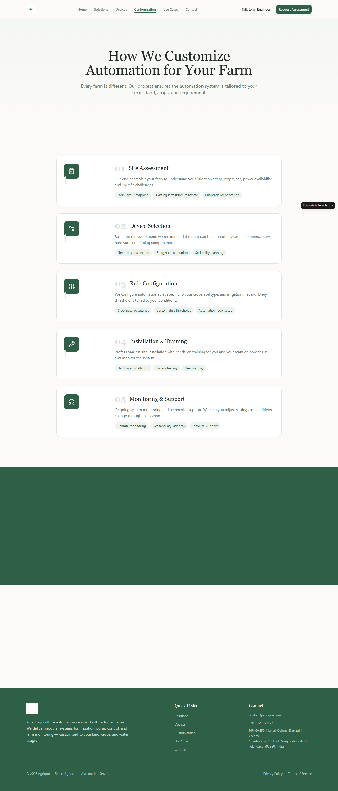

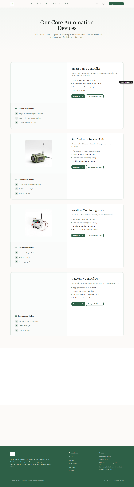

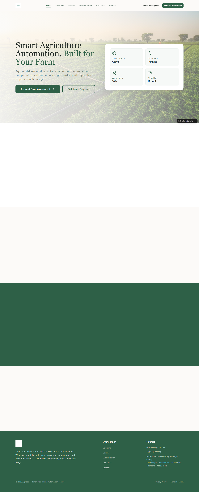

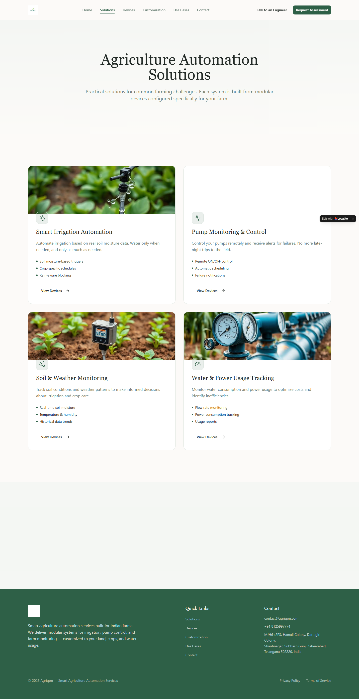

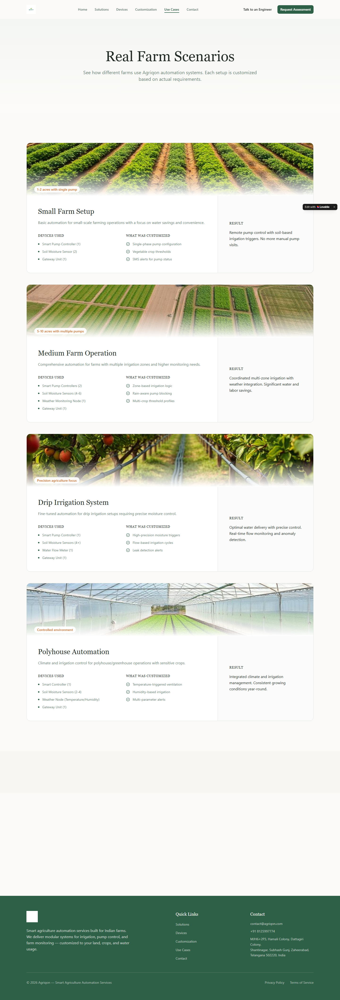

### Section Clips (screens/sections/)

*Clipped individual sections and components*

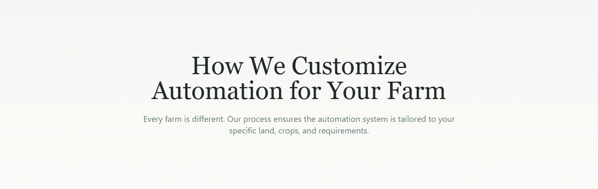

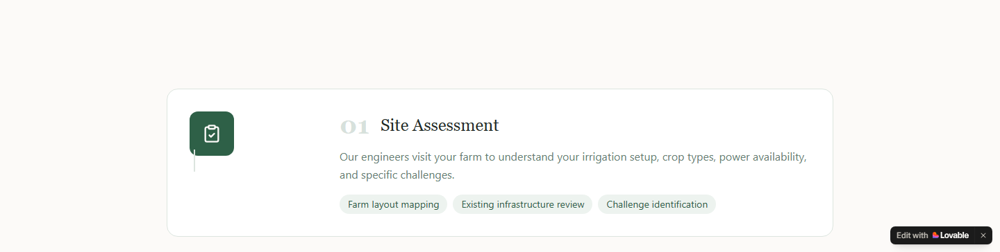

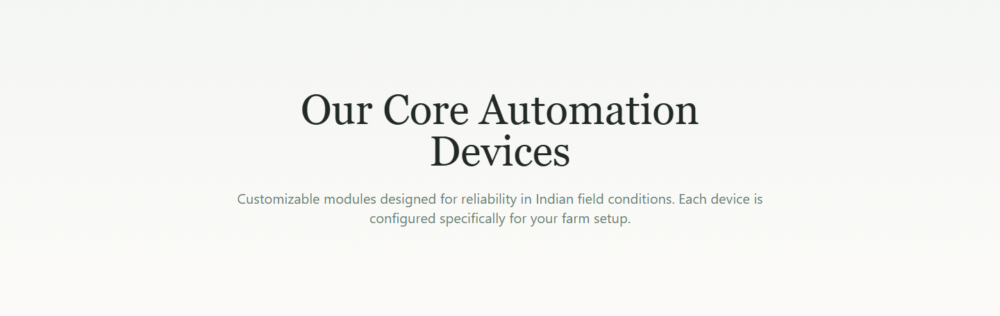

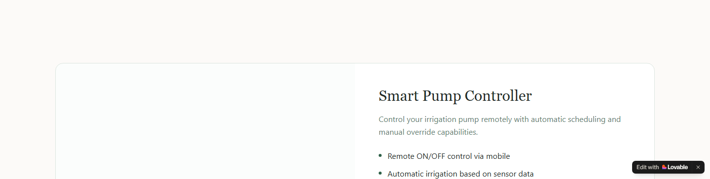

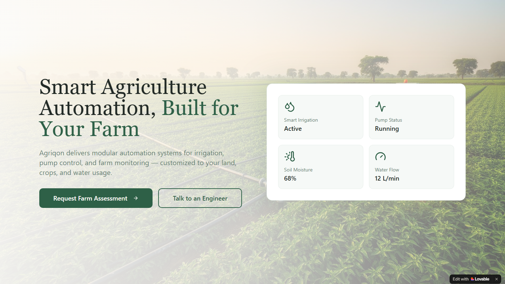


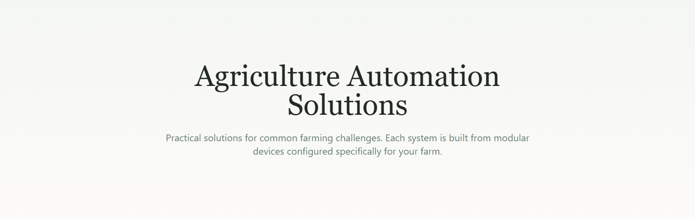

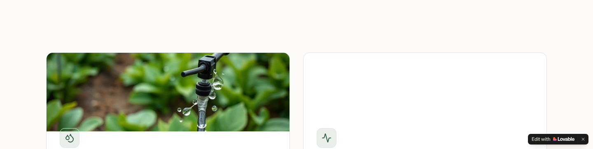

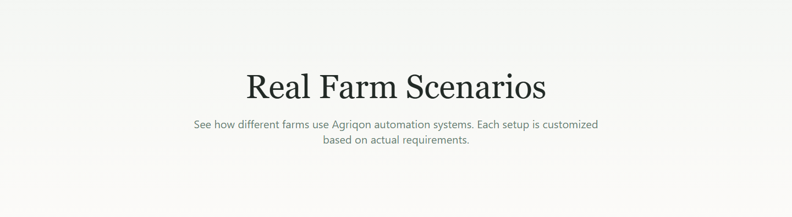

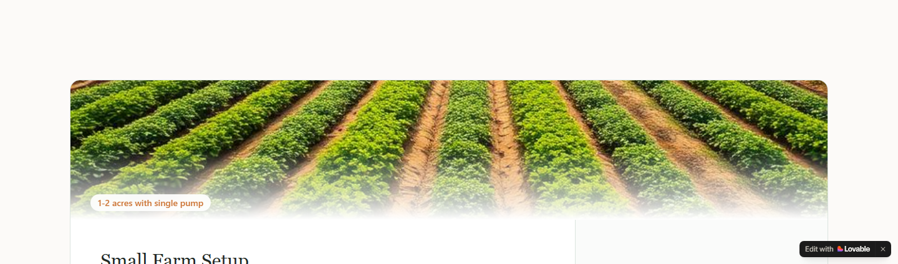

### Interaction States (screens/states/)

*Hover, focus, and active state captures*

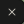

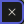


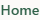

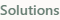


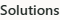

### Screenshot Index (screens/INDEX.md)

# Screenshot Index

## Scroll Journey

> Shows the cinematic state at each point of the page

| Scroll | Y Position | File |
|--------|-----------|------|
| 0% | 0px | `screens/scroll/scroll-000.png` |
| 17% | 453px | `screens/scroll/scroll-017.png` |
| 33% | 879px | `screens/scroll/scroll-033.png` |
| 50% | 1332px | `screens/scroll/scroll-050.png` |
| 67% | 1784px | `screens/scroll/scroll-067.png` |
| 83% | 2210px | `screens/scroll/scroll-083.png` |
| 100% | 2663px | `screens/scroll/scroll-100.png` |

## Pages

| Page | URL | File |
|------|-----|------|
| Agriqon - Smart Agriculture Automation for Indian Farms | `https://agriqon.lovable.app/` | `screens/pages/home.png` |
| Agriqon - Smart Agriculture Automation for Indian Farms | `https://agriqon.lovable.app/solutions` | `screens/pages/solutions.png` |
| Agriqon - Smart Agriculture Automation for Indian Farms | `https://agriqon.lovable.app/devices` | `screens/pages/devices.png` |
| Agriqon - Smart Agriculture Automation for Indian Farms | `https://agriqon.lovable.app/customization` | `screens/pages/customization.png` |
| Agriqon - Smart Agriculture Automation for Indian Farms | `https://agriqon.lovable.app/use-cases` | `screens/pages/use-cases.png` |

## Sections

| Page | Section | File |
|------|---------|------|
| home | #1 (section) | `screens/sections/home-section-1.png` |
| home | #2 (section) | `screens/sections/home-section-2.png` |
| solutions | #1 (section) | `screens/sections/solutions-section-1.png` |
| solutions | #2 (section) | `screens/sections/solutions-section-2.png` |
| devices | #1 (section) | `screens/sections/devices-section-1.png` |
| devices | #2 (section) | `screens/sections/devices-section-2.png` |
| customization | #1 (section) | `screens/sections/customization-section-1.png` |
| customization | #2 (section) | `screens/sections/customization-section-2.png` |
| use-cases | #1 (section) | `screens/sections/use-cases-section-1.png` |
| use-cases | #2 (section) | `screens/sections/use-cases-section-2.png` |

## Homepage Screenshots (screenshots/)


